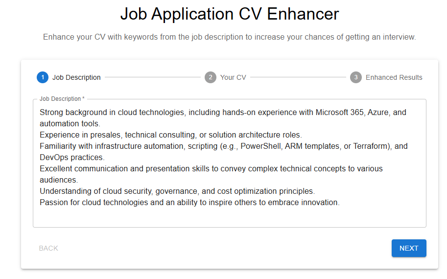
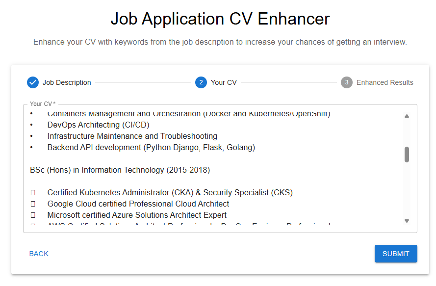
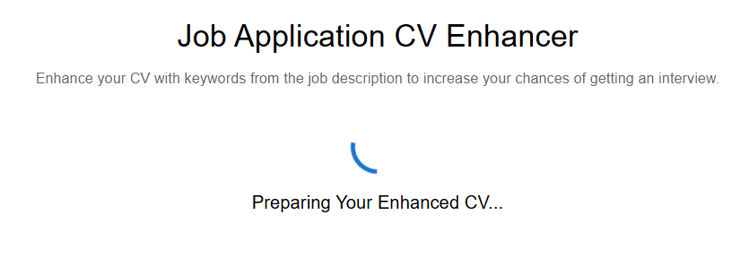
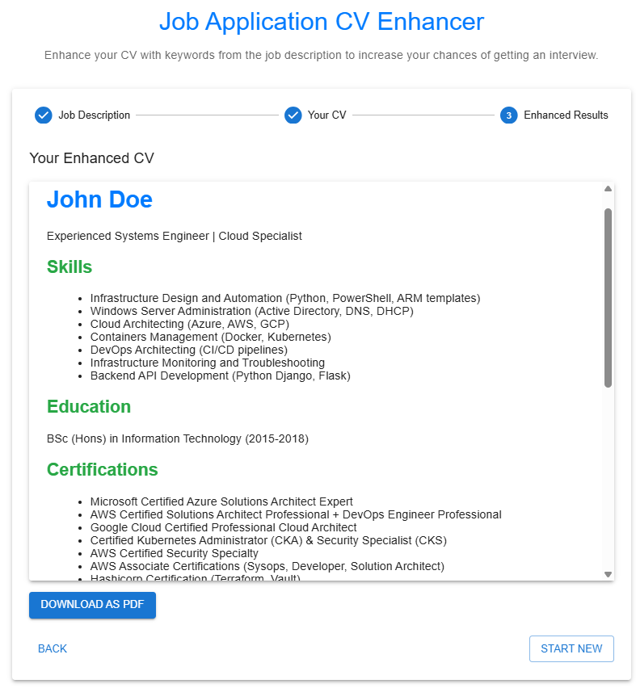

# CV Enhancer
A smart application that optimizes your CV/resume to match job descriptions by leveraging AI to identify and incorporate relevant keywords and skills.

## 🚀 Features
- **Job Description Analysis**: Extract key skills, technologies, and qualifications from job postings
- **CV Enhancement**: Intelligently modify your CV to highlight relevant experience matching job requirements
- **Keyword Optimization**: Add appropriate keywords from the job description to your CV
- **Formatted Output**: Generate a professionally formatted CV in HTML format
- **PDF Export**: Download your enhanced CV as a PDF file
- **User-Friendly Interface**: Clean, step-by-step process with Material UI components

## 📸 Screenshots

<div align="center">
  
  
  <p><em>Paste Role Description</em></p>

  
  <p><em>Paste CV</em></p>

  
  <p><em>Processing</em></p>

  
  <p><em>Enhanced CV and PDF Download</em></p>
</div>

## 📋 Tech Stack
### Frontend
- React.js
- Material UI
- jsPDF (for PDF generation)
- html2canvas (for HTML to canvas conversion)

### Backend
- FastAPI (Python)
- LangChain (for AI template processing)
- OpenAI API (for intelligent CV enhancement)

## 🛠️ Installation and Setup
### Prerequisites
- Node.js (v14+)
- Python (v3.8+)
- OpenAI API key

### Frontend Setup
```bash
# Clone the repository
git clone https://github.com/yourusername/cv-enhancer.git
cd cv-enhancer/frontend
# Install dependencies
npm install
# Start the development server
npm start
```

### Backend Setup
```bash
# Navigate to the backend directory
cd cv-enhancer/backend
# Create a virtual environment
python -m venv venv
source venv/bin/activate  # On Windows: venv\Scripts\activate
# Install dependencies
pip install -r requirements.txt
# Create a .env file with your OpenAI API key
echo "OPENAI_API_KEY=your_api_key_here" > .env
# Start the FastAPI server
uvicorn main:app --reload
```

## 📝 How to Use
1. Navigate to the application in your browser (default: http://localhost:3000)
2. **Step 1**: Paste the job description into the first text field
3. **Step 2**: Paste your current CV/resume into the second text field
4. **Step 3**: Click Submit and wait for the enhancement process to complete
5. Review your enhanced CV and download it as a PDF if satisfied

## 🔧 Configuration
### Environment Variables
Backend (`.env` file):
```
OPENAI_API_KEY=your_openai_api_key
MODEL_NAME=gpt-4  # or gpt-3.5-turbo for faster but less detailed results
```

## 💡 How It Works
1. The application extracts key requirements, skills, and qualifications from the job description
2. Your original CV is analyzed to identify relevant experience and skills
3. The AI leverages LangChain and OpenAI to enhance your CV by:
   - Restructuring content to highlight relevant experience
   - Adding appropriate keywords from the job description
   - Improving formatting and readability
   - Maintaining truthfulness (no fabricated experience)
4. The enhanced CV is presented in HTML format, ready for download as a PDF

## 👨‍💻 Developer
- **Kugathasan Janarthanan**

## 📌 Blog
For more information and updates, visit: [https://myblog/project](https://myblog/project)

## 🤝 Contributing
Contributions, issues, and feature requests are welcome!

## 📜 License
Distributed under the MIT License. See `LICENSE` for more information.